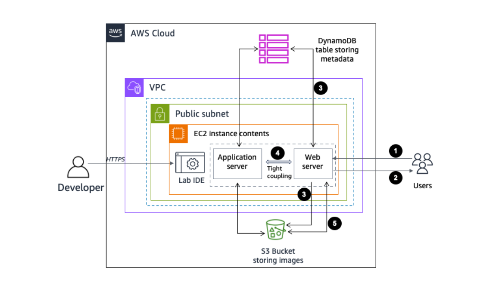
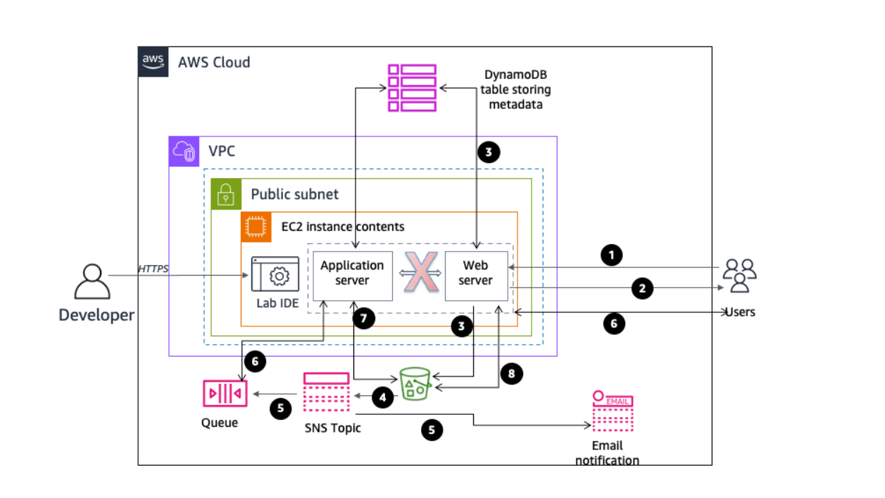

# Event-Driven Image Processing System with AWS SQS and SNS

## Project Overview
This project demonstrates the implementation of a decoupled architectural pattern using AWS services. The system transitioned from a monolithic, tightly coupled design (Phase 1) to an asynchronous, event-driven architecture (Phase 2). This setup improves system scalability, fault tolerance, and ensures that the web tier and application tier operate independently.

## Lab Objectives Achieved
* Configured Amazon S3 bucket events to trigger SNS notifications upon object creation.
* Implemented an Amazon SNS topic to fan-out messages to SQS and Email endpoints.
* Subscribed an Amazon SQS queue to an SNS topic to store processing tasks.
* Developed a Node.js application server that implements long-polling to consume SQS messages.
* Integrated Amazon DynamoDB for real-time image metadata and status tracking.

## Technical Architecture

### Phase 1: Tightly Coupled (Synchronous)
The Web Server communicated directly with the Application Server via HTTP. If the App Server was down or busy, the user experience was directly impacted, and the request would fail.

### Phase 2: Decoupled (Asynchronous)
The communication is now mediated by AWS messaging services:
1. **Upload:** User uploads an image to **Amazon S3**.
2. **Notify:** S3 sends an event to **Amazon SNS**.
3. **Queue:** SNS pushes the message to **Amazon SQS**.
4. **Process:** The **Application Server** polls SQS, processes the image using the **Sharp** library, and updates **Amazon DynamoDB**.

## Components and Services
* **Compute:** Amazon EC2 (Node.js Environment).
* **Messaging:** Amazon SQS (Queueing) & Amazon SNS (Pub/Sub).
* **Storage:** Amazon S3 (Object Storage).
* **Database:** Amazon DynamoDB (Metadata storage).
* **Image Processing:** Sharp.js (Tinting and Resizing).

## File Structure
* **app-server/index.js**: Express server handling the polling control routes.
* **app-server/libs/polling.js**: Core logic for SQS `receiveMessage` and `deleteMessage` operations.
* **app-server/libs/config.js**: AWS Resource configuration (Queue URLs, Bucket names, Regions).

## Visual Documentation

### Phase 1 vs Phase 2 Architecture

### Application & Notifications

---
*Verified Implementation of the Guided Lab: Building Decoupled Applications by Using Amazon SQS.*
